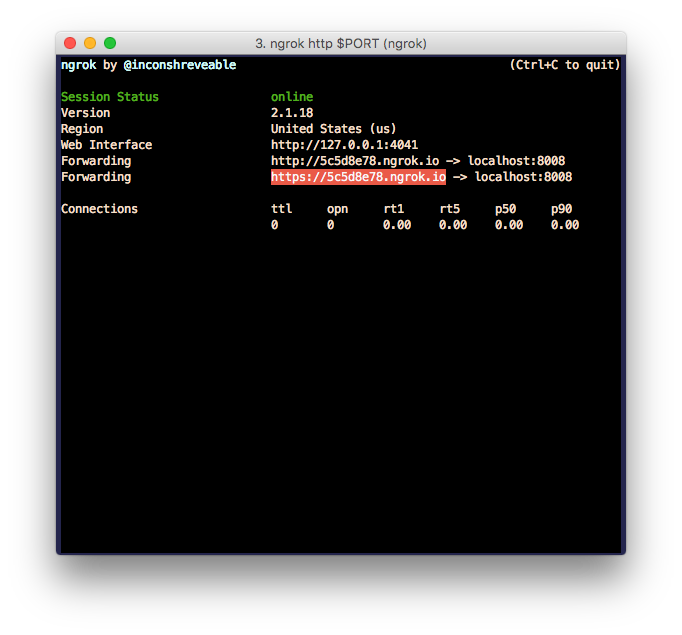

## Forwarding SMS with Nexmo and SMSBCC

If you have spent any time in an airport you'll know that there are two things
which every traveller covets; a power socket and free Wifi. Free airport Wifi
can often save you horrendous data roaming charges, but they come with their
own cost. You exchange your contact details in order to get online.

"Enter your mobile number and we'll text you an access code" is the most
common pattern I've seen in Airports and Coffee shops. And of course because
you have to receive the PIN code in order to log in, you have to give them
your real mobile number which may open you up to automated sales calls...

> Hello, I'm calling with regard to your accident and potential personal injury claim

We need a second disposable number we can give out instead of our real number
when we're concerned about our privacy. Now you could buy a second burner phone,
or we could use a virtual number which forwards all incoming SMS to our real
number, acting as a privacy shield or proxy.

## Getting started

Things you will need:

- [Nexmo](https://www.nexmo.com/) account
- [Node.js](https://nodejs.org/en/download/)
- [Yarn](https://yarnpkg.com/lang/en/docs/install/)
- [ngrok](https://ngrok.com/) (or a public server to deploy to)

Once you have everything installed grab the latest release of
[SMSBCC](https://github.com/aaronbassett/SMSBCC/releases)

    git clone git@github.com:aaronbassett/SMSBCC.git
    cd SMSBCC
    yarn

Your SMSBCC server requires a few different environment variables set.

| variable name     | description                                       | default       |
|-------------------|---------------------------------------------------|---------------|
| PORT              | Port SMSBCC will listen on                        | 8008          |
| NEXMO_FROM        | An alphanumeric string giving your sender address | SMSBCC        |
| NEXMO_TO          | The mobile number to forward messages to          | -             |
| NEXMO_API_KEY     | Your Nexmo API key                                | -             |
| NEXMO_API_SECRET  | Your Nexmo API secret                             | -             |
| NEXMO_WEBHOOK_URL | The public URL of your SMSBCC server              | -             |

To start your server run `yarn start`

We need to expose our SMSBCC server to public internet so that our Nexmo webhook
can reach it. We can create a tunnel to localhost using [ngrok](https://ngrok.com/).

    ngrok http $PORT

Copy the https address from the ngrok terminal and enter it as the SMS webhook
url for one of your [Nexmo virtual numbers](https://dashboard.nexmo.com/your-numbers).

Now if you send an SMS to your Nexmo number it should be automatically forwarded
to your private number.

## How it works

Most of the heavy lifting is done by
[/src/server/index.js](https://github.com/aaronbassett/SMSBCC/blob/master/src/server/index.js).
When Nexmo recieves an inbound SMS on your virtual number it triggers a webhook
which makes a GET request to your SMSBCC server.

SMSBCC looks for the text of the original SMS in the request query string and
then uses the Nexmo API to send a new SMS to our private number.



The `client.message.sendSms` is part of the
[Nexmo REST API wrapper](https://www.npmjs.com/package/nexmo)

    # You can install it using npm
    npm install nexmo

    # Or with Yarn
    yarn add nexmo

We've wrapped our API calls in promises to make our `index.js` more readable.



- [Search](https://docs.nexmo.com/tools/developer-api/number-search) for a number _(filtered by country)_
- [Buy](https://docs.nexmo.com/tools/developer-api/number-buy) the first available number we find
- [Update](https://docs.nexmo.com/tools/developer-api/number-update) the Webhook URL for our new number
- [Send](https://docs.nexmo.com/messaging/sms-api) the new number to our phone via SMS

## Buying new numbers

If you've ran out of time on the free Wifi and you need a different number to
register again, or the sign-up process needs a number from a specific country
you can buy new numbers via SMS by texting your SMSBCC number with

> New XX

Where *XX* is the [ISO 3166-1 alpha-2](https://en.wikipedia.org/wiki/ISO_3166-1_alpha-2)
2 character code for the country you need a new number for. You'll receive a SMS
once the new number has been purchased and is ready for use.

### Further development ideas

- Delete number(s) via SMS
- Mute all forwards for _x_ minutes/hours
- Use NLP to only forward messages which appear to contain a PIN
- Make bi-directional so it can be used as a burner number when you don't want to give someone your real number
